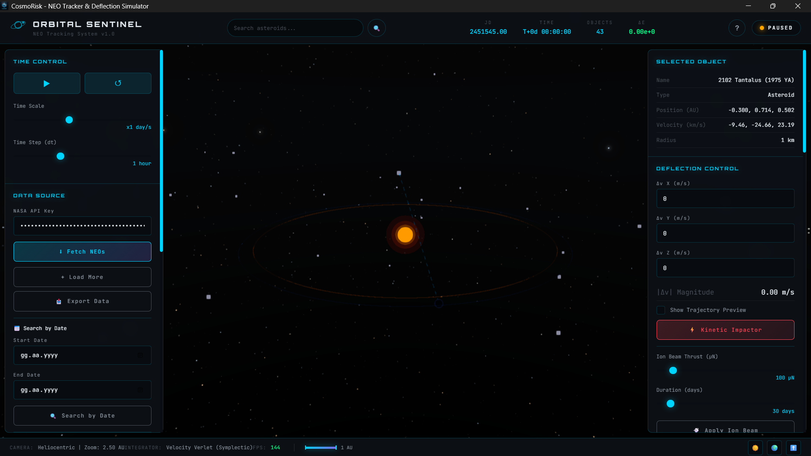

# CosmoRisk

## High-Fidelity NEO Defense Simulator

[](https://opensource.org/licenses/MIT)
[](https://github.com/SpaceEngineerSS/CosmoRisk)
[](https://github.com/SpaceEngineerSS/CosmoRisk/releases)
[](https://www.rust-lang.org/)
[](https://www.typescriptlang.org/)
[](https://www.virustotal.com/)



**CosmoRisk** is a state-of-the-art, physics-accurate Near-Earth Object (NEO) tracking and deflection simulator. Built with Rust for computational precision and Three.js for cinematic visualization.

---

## 🚀 Features

### Core Simulation
- **N-Body Gravity Simulation** - Accurate gravitational interactions between Sun, Earth, Moon, and thousands of asteroids
- **NASA NeoWs Integration** - Real asteroid data from NASA's Near-Earth Object Web Service
- **Monte Carlo Impact Probability** - Statistical impact risk analysis

### Deflection Methods
- **Kinetic Impactor** - Instantaneous Δv impulse (DART-like)
- **Ion Beam Deflection** - Continuous low-thrust over extended duration
- **Gravity Tractor** - Passive gravitational deflection (backend)

### Visualization
- **3D Celestial Bodies** - Sun (3-layer corona), Earth (blue marble + atmosphere), Moon
- **Asteroid Rendering** - Rocky brown material with faceted shading, LOD system
- **Asteroid Trails** - 50-point fading gradient trails
- **Distance Lines** - Visual connection from asteroid to Earth
- **Post-Processing** - Unreal Bloom, SSAO, FXAA for cinematic quality

### Analysis Tools
- **Torino Scale** - 0-10 impact hazard classification
- **MOID Calculator** - Proper orbital intersection distance using 72×72 point sampling
- **3D Orbit Visualization** - Accurate Keplerian orbits with inclination, RAAN, and argument of perihelion
- **Spectral Type Analysis** - C/S/M/X/V composition types
- **Comparison Table** - Side-by-side asteroid data comparison
- **Energy Conservation Chart** - Real-time energy drift monitoring

### Educational Features
- **Onboarding Tutorial** - 5-step interactive guide
- **Glossary** - 12 scientific terms explained
- **"Did You Know" Facts** - 10 asteroid fun facts
- **Historical Impacts** - Chicxulub, Tunguska, and more
- **What-If Scenarios** - Save/load simulation states

### Mobile UX
- **Pinch-to-Zoom** - 2-finger zoom gesture
- **Swipe Camera** - Horizontal swipe to change camera
- **Bottom Sheet** - Panel content for mobile screens
- **Mobile Navigation** - 3-button bottom nav bar

---

## 📐 Scientific Methodology

### Integrator
We use the **Velocity Verlet** symplectic integrator for energy conservation:

$$x(t+\Delta t) = x(t) + v(t)\Delta t + \frac{1}{2}a(t)\Delta t^2$$

$$v(t+\Delta t) = v(t) + \frac{1}{2}[a(t) + a(t+\Delta t)]\Delta t$$

### Perturbations

| Effect | Formula | Reference |
|--------|---------|-----------|
| **J2 Oblateness** | $a_{J_2} = -\frac{3}{2} J_2 \frac{\mu R_E^2}{r^5} [x(1-5z^2/r^2), y(1-5z^2/r^2), z(3-5z^2/r^2)]$ | Vallado (2007) |
| **Solar Radiation Pressure** | $a_{SRP} = \frac{P \cdot A \cdot C_R}{m} \cdot \hat{r}$ | Montenbruck & Gill (2000) |
| **Yarkovsky Effect** | $\frac{da}{dt} \approx \frac{\alpha}{D \cdot r^2}$ | Vokrouhlický et al. (2000) |
| **Jupiter Perturbation** | N-body gravitational influence | Orbital mechanics |
| **Mars Perturbation** | N-body gravitational influence | Orbital mechanics |
| **Moon Perturbation** | N-body gravitational influence | Close Earth approaches |

### Physical Constants

```
G         = 6.67430×10⁻¹¹ m³/(kg·s²)      Gravitational constant
AU        = 1.495978707×10¹¹ m            Astronomical Unit
μ_Sun     = 1.327124×10²⁰ m³/s²           Sun's gravitational parameter
μ_Earth   = 3.986004×10¹⁴ m³/s²           Earth's gravitational parameter
μ_Moon    = 4.904869×10¹² m³/s²           Moon's gravitational parameter
J₂_Earth  = 1.08263×10⁻³                   Earth oblateness coefficient
R_Earth   = 6.378137×10⁶ m                Earth equatorial radius
P_SRP     = 4.56×10⁻⁶ N/m²                Solar radiation pressure (1 AU)
```

---

## 🛠️ Installation

### Prerequisites
- [Node.js](https://nodejs.org/) v18+
- [Rust](https://www.rust-lang.org/tools/install) 1.70+
- [Tauri CLI](https://tauri.app/v1/guides/getting-started/prerequisites)

### Setup

```bash
# Clone repository
git clone https://github.com/SpaceEngineerSS/CosmoRisk.git
cd CosmoRisk

# Install dependencies
npm install

# Run in development mode
npm run tauri dev

# Build production executable
npm run tauri build
```

### 📥 Pre-Built Downloads (Windows)

Download the latest release from [GitHub Releases](https://github.com/SpaceEngineerSS/CosmoRisk/releases).

#### ⚠️ Windows SmartScreen Warning

When running the `.exe` for the first time, Windows SmartScreen may show a warning because the application is new and not yet widely distributed. **This is normal for new software.**

**To run the application:**
1. Click **"More info"** on the warning dialog
2. Click **"Run anyway"**


#### 🔒 Security Verification

We take security seriously. You can verify the application is safe:

| Verification | Link |
|--------------|------|
| **VirusTotal Scan** | [View Scan Results](https://www.virustotal.com/gui/file/29bedc4595de31cdcb0a80b3620438a215761b72fd641302bc94e01387f2df90) |
| **Source Code** | [GitHub Repository](https://github.com/SpaceEngineerSS/CosmoRisk) |
| **Publisher** | Mehmet Gümüş |

> **Note:** The exe is signed with a self-signed certificate. File properties will show "Mehmet Gümüş" as the publisher.

---

## 🎮 Usage

1. **Obtain NASA API Key**: Get a free key from [NASA API Portal](https://api.nasa.gov/)
2. **Enter API Key**: Paste in the left panel's "NASA API Key" field
3. **Fetch NEOs**: Click "Fetch NEOs" to load real asteroid data
4. **Select Asteroid**: Click on any asteroid to view details
5. **Apply Deflection**: Use kinetic impactor (Δv) or ion beam controls
6. **Monitor Impact Prediction**: Watch the "Impact Prediction" panel

### Keyboard Shortcuts

| Key | Action |
|-----|--------|
| `Space` | Play/Pause |
| `R` | Reset simulation |
| `+/-` | Speed up/slow down |
| `1/2/3` | Camera presets (Sun/Earth/Top) |
| `O` | Toggle orbit visibility |
| `G` | Toggle grid |
| `F` | Zoom to fit all asteroids |
| `T` | Toggle theme (dark/light) |
| `D` | Show random asteroid fact |
| `?` | Show shortcuts modal |

---

## 📊 Performance

| Metric | Value |
|--------|-------|
| Max Asteroids | 10,000+ |
| LOD System | Distance-based Points/Mesh |
| Target FPS | 60 |
| Achieved FPS | 53-62 |
| Energy Drift | < 10⁻⁵ over 100 years |

---

## 🗺️ Roadmap

### Completed ✅
- [x] N-Body gravity simulation
- [x] Velocity Verlet integrator
- [x] NASA NeoWs API integration
- [x] Kinetic impactor deflection
- [x] Ion beam deflection
- [x] Gravity tractor (backend)
- [x] Yarkovsky thermal effect
- [x] Jupiter/Mars perturbations
- [x] Monte Carlo impact probability
- [x] Post-processing (Bloom, SSAO, FXAA)
- [x] Torino Scale & MOID analysis
- [x] Tutorial & Glossary
- [x] Theme toggle & settings persistence
- [x] Mobile touch gestures
- [x] Asteroid trails (fading)
- [x] Comparison table
- [x] Mobile bottom sheet

### Future 🔮
- [ ] Relativistic precession
- [ ] VR/AR support
- [ ] JPL Horizons integration

---

## 📖 Citation

If you use Orbital Sentinel in your research, please cite:

```bibtex
@software{orbital_sentinel_2025,
  author = {Mehmet Gümüş},
  title = {Orbital Sentinel: High-Fidelity NEO Defense Simulator},
  version = {2.0.1},
  year = {2025},
  url = {https://github.com/SpaceEngineerSS/CosmoRisk}
}
```

---

## 📄 License

This project is licensed under the MIT License - see the [LICENSE](LICENSE) file for details.

---

## 🤝 Contributing

Contributions are welcome! Please see [CONTRIBUTING.md](CONTRIBUTING.md) for guidelines.

---

## 👨‍💻 Developer

This project was developed by **Mehmet Gümüş**.

- 🌐 Website: [spacegumus.com.tr](https://spacegumus.com.tr)
- 🐙 GitHub: [@SpaceEngineerSS](https://github.com/SpaceEngineerSS)

---

## 🙏 Acknowledgments

- NASA Near-Earth Object Program
- Three.js community
- Tauri team
- Academic references: Vallado (2007), Montenbruck & Gill (2000), Vokrouhlický et al. (2000)

---

*Last updated: 18.12.2025*
